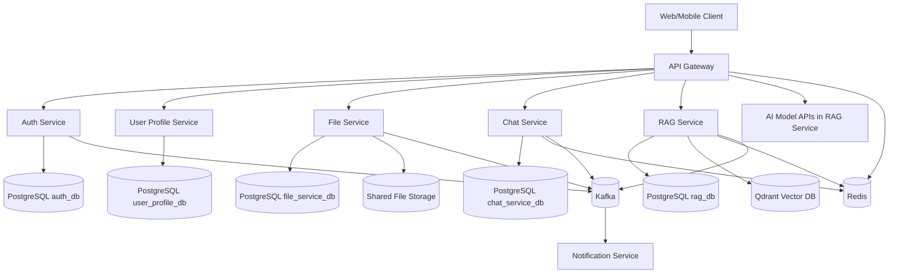
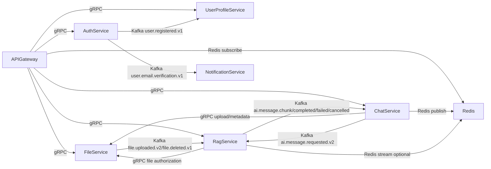
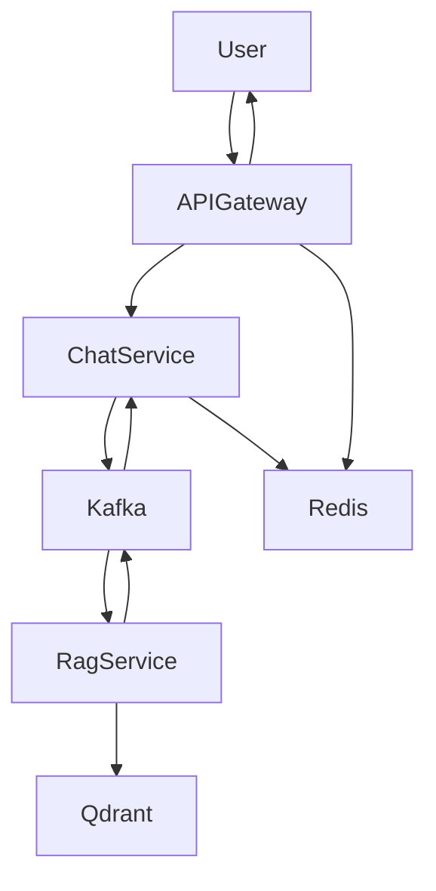

# AI Learning Platform - Backend

## Overview
AI Learning Platform backend is a microservices system for authentication, user profile management, file lifecycle, conversational chat, AI retrieval-augmented generation (RAG), and asynchronous notifications. The platform uses gRPC for internal synchronous communication, Kafka for asynchronous event-driven workflows, PostgreSQL for transactional state, Redis for realtime fan-out/rate-limiting, and Qdrant for vector retrieval.

## Full System Architecture Diagram (MANDATORY)

## Services Overview
| Service | Responsibility | Tech | Database |
| --- | --- | --- | --- |
| api-gateway | Public REST/SSE/WebSocket edge, JWT/rate-limit, gRPC fan-out | Spring Boot WebFlux + Spring Cloud Gateway | Redis (operational state) |
| auth-service | Identity, login, JWT, refresh tokens, verification lifecycle | Spring Boot + JPA + Flyway + gRPC | PostgreSQL (`auth_db`) |
| user-profile-service | Profile metadata, visibility, search, reputation | Spring Boot + JPA + Flyway + gRPC | PostgreSQL (`user_profile_db`) |
| file-service | File/folder metadata, sharing ACLs, binary storage and stream RPCs | Spring Boot + JPA + Flyway + gRPC | PostgreSQL (`file_service_db`) + filesystem volume |
| chat-service | Chatroom/message persistence, AI request dispatch, realtime hooks | Spring Boot + JPA + Flyway + gRPC + Kafka + Redis | PostgreSQL (`chat_service_db`) + Redis |
| rag-service | Ingestion, retrieval, execution pipeline, model-provider orchestration | FastAPI + gRPC + SQLAlchemy + Kafka + Qdrant | PostgreSQL (`rag_db`) + Qdrant |
| notification-service | Email verification consumer and SMTP delivery | FastAPI + Kafka + SMTP | No persistent DB |
| proto | Shared protobuf contracts for all gRPC service APIs | Protocol Buffers | No DB |

## Service Communication Diagram (MANDATORY)

## Data Architecture (MANDATORY)
- Per-service ownership:
  - Each business service owns its own persistence boundary and schema.
  - Cross-service references are logical identifiers (for example `user_id`, `file_id`) rather than foreign keys across databases.
- Data isolation strategy:
  - No shared transactional database across services.
  - Service-specific migrations and repository layers isolate model evolution.
  - Asynchronous events synchronize derived state where needed (profile bootstrap, notifications, ingestion).
- Cross-service data flow:
  - Auth publishes user lifecycle events.
  - File service publishes ingestion/deletion events consumed by RAG.
  - Chat and RAG exchange AI lifecycle events through Kafka topics.
  - Gateway and chat rely on Redis for low-latency event fan-out.

## High-Level Data Flow Diagram (MANDATORY)

## Authentication Flow
1. Client calls `POST /api/auth/signup` or `POST /api/auth/login` at gateway.
2. Gateway validates request and routes to auth-service gRPC.
3. Auth-service validates identity, issues tokens, persists refresh token state.
4. On signup, auth-service emits `user.registered.v1` and `user.email.verification.v1`.
5. User-profile-service consumes registration to create default profile.
6. Notification-service consumes verification event and sends email.

## AI / RAG Flow
1. Client sends chat message to gateway `POST /api/chat/messages`.
2. Gateway forwards to chat-service via gRPC.
3. Chat-service persists message and publishes `ai.message.requested.v2`.
4. RAG service consumes request, authorizes file access against file-service, retrieves context from Qdrant, executes provider pipeline, and emits chunk/completion/failure events.
5. Chat-service consumes AI stream events and republishes to Redis channels.
6. Gateway streams updates to clients via SSE/WebSocket.

## Deployment Architecture
- Primary orchestration is Docker Compose at repository root (`docker-compose.yml`).
- Compose provisions Kafka, Redis, service-specific PostgreSQL instances, Qdrant, TEI embedding service, and all application services.
- Shared file storage volume is mounted read-write by file-service and read-only by rag-service.
- Services use internal network DNS names for service-to-service calls (for example `auth-service:9090`).

## Development Workflow
1. Update protobuf contracts in `proto/` when service interfaces change.
2. Implement service changes in the owning microservice with migrations/tests.
3. Run local service(s) and infrastructure via Docker Compose.
4. Validate integration paths through gateway endpoints.
5. Update service README and this root README for any architecture/contract/data-flow change.

## Future Improvements
- Introduce centralized schema registry and version compatibility policy for Kafka event payloads.
- Add OpenTelemetry traces across gateway, gRPC calls, and Kafka pipelines.
- Move notification idempotency to shared durable store (Redis/PostgreSQL) for multi-replica correctness.
- Add API versioning policy at gateway and backward-compatible contract checks for protobuf changes.
- Expand resilience policies: circuit breakers, retry budgets, and dead-letter replay tooling.
