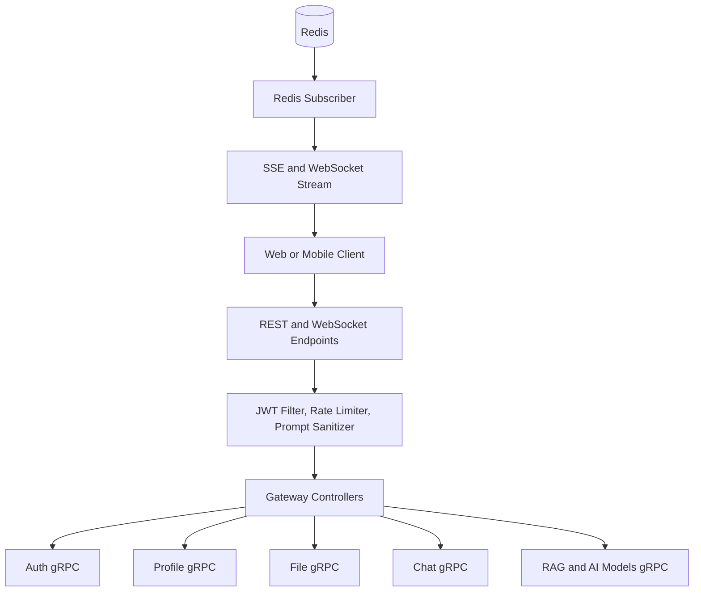

# API Gateway

## Overview
The API Gateway is the public entry point for the AI Learning Platform backend. It exposes HTTP and WebSocket interfaces, validates JWT access tokens, applies rate limits and request sanitization, and translates client-facing REST calls into internal gRPC requests to downstream services.

## Responsibilities
- Expose public REST APIs for auth, profile, file, chat, RAG, and AI model operations.
- Enforce authentication and authorization at the edge via JWT validation.
- Apply per-route rate limiting using Redis-backed Spring Cloud Gateway filters.
- Sanitize AI prompt payloads for high-risk endpoints before forwarding.
- Bridge real-time events to clients over SSE and WebSocket from Redis channels/streams.
- Propagate request metadata (user id, correlation id, service secret) to gRPC backends.

## Architecture
The service is a Spring Boot WebFlux + Spring Cloud Gateway application.

- Routing layer:
  - `application.yml` defines route predicates, path rewrites, and rate-limit filters for `/api/auth/**`, `/api/profile/**`, `/api/files/**`, `/api/chat/**`, `/api/rag/**`, and `/api/ai/**`.
- Controller layer:
  - Internal controllers under `controller/` expose `/api/internal/**` endpoints and call gRPC blocking stubs.
- Security layer:
  - `JwtGlobalFilter` enforces Bearer token checks for non-public routes.
  - `JwtValidationService` validates issuer and signature using the public key.
- Input protection:
  - `PromptInjectionSanitizationFilter` runs on AI message/execution POST routes.
- Realtime layer:
  - `ChatWebSocketHandler` and `ChatWebSocketConfig` provide `/ws/chat`.
  - `ChatRedisSubscriber` subscribes to Redis pub/sub channels and Redis streams for AI updates.

## API / gRPC Contracts
### Exposed REST APIs
- Auth:
  - `POST /api/auth/signup`
  - `POST /api/auth/login`
  - `POST /api/auth/verify-email`
  - `POST /api/auth/resend-verification`
  - `POST /api/auth/refresh`
  - `POST /api/auth/logout`
- Profile:
  - `GET /api/profile/me`
  - `GET /api/profile/{userId}`
  - `PUT /api/profile/me`
  - `GET /api/profile/search`
  - `PATCH /api/profile/visibility`
  - `POST /api/profile/reputation`
- File:
  - File/folder CRUD and sharing under `/api/files/**`
  - Upload endpoints include multipart and base64 variants
- Chat:
  - `POST /api/chat/messages`
  - `GET /api/chat/chatrooms`
  - `GET /api/chat/chatrooms/{chatroomId}`
  - `GET /api/chat/chatrooms/{chatroomId}/messages`
  - `POST /api/chat/chatrooms/{chatroomId}/typing`
  - `GET /api/chat/messages/{messageId}/stream` (SSE)
  - `POST /api/chat/messages/{messageId}/cancel`
- Direct AI execution:
  - `POST /api/ai/executions`
  - `GET /api/ai/executions/{executionId}`
  - `DELETE /api/ai/executions/{executionId}`

### gRPC contracts consumed
- `proto/auth.proto` via `AuthService`
- `proto/profile.proto` via `UserProfileService`
- `proto/file.proto` via `FileService`
- `proto/chat.proto` via `ChatService`
- `proto/rag.proto` via `RagService`
- `proto/ai_models.proto` via `AiModelService`

## Data Layer
- Primary database: none (stateless gateway).
- Redis usage:
  - Request rate limiter state.
  - Realtime pub/sub channels for chat and typing events.
  - Redis streams for AI execution stream fan-out.

## Communication
- Inbound:
  - HTTP/JSON REST from clients.
  - WebSocket connections on `/ws/chat`.
- Outbound (synchronous):
  - gRPC calls to auth, user-profile, file, chat, and rag services.
- Outbound (asynchronous consumption):
  - Redis pub/sub and stream reads for realtime chat and AI stream delivery.

## Key Workflows
1. Auth request flow
   - Client calls `/api/auth/*`.
   - Gateway applies route-specific rate limiting and path rewrite to `/api/internal/auth/*`.
   - Controller maps request to `AuthService` gRPC call.
   - Response is normalized back to HTTP.
2. AI execution flow
   - Client calls `POST /api/ai/executions`.
   - JWT and payload sanitization filters run.
   - Gateway calls `RagService.ExecuteDirect` with user metadata.
   - Client polls status or subscribes to SSE stream endpoint.
3. Realtime chat flow
   - Client sends message via `/api/chat/messages`.
   - Gateway forwards to chat-service gRPC.
   - Chat and AI events are consumed from Redis and emitted over SSE/WebSocket.

## Diagram
