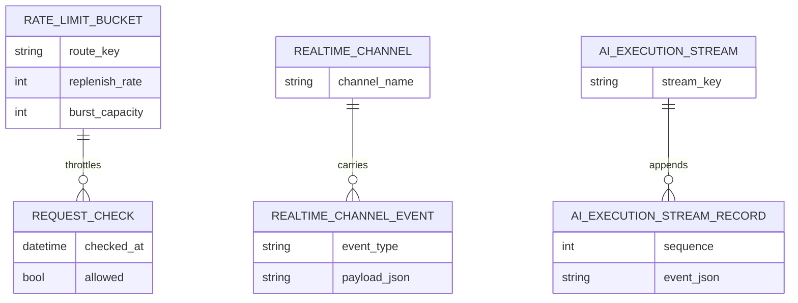
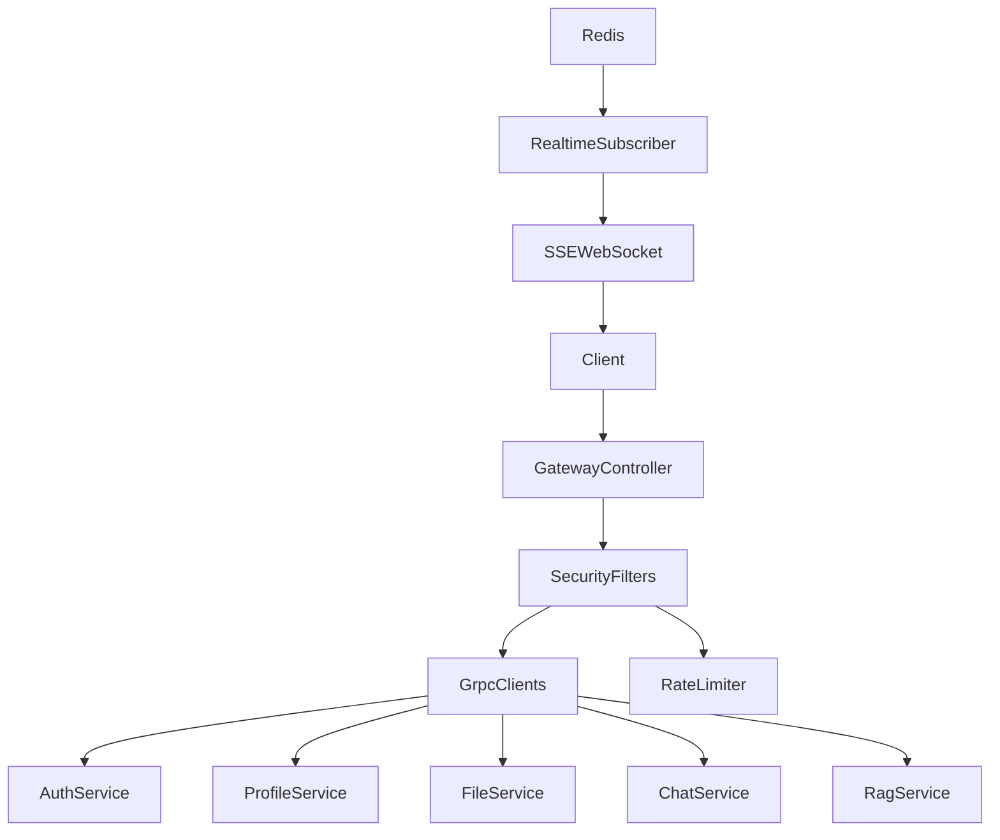
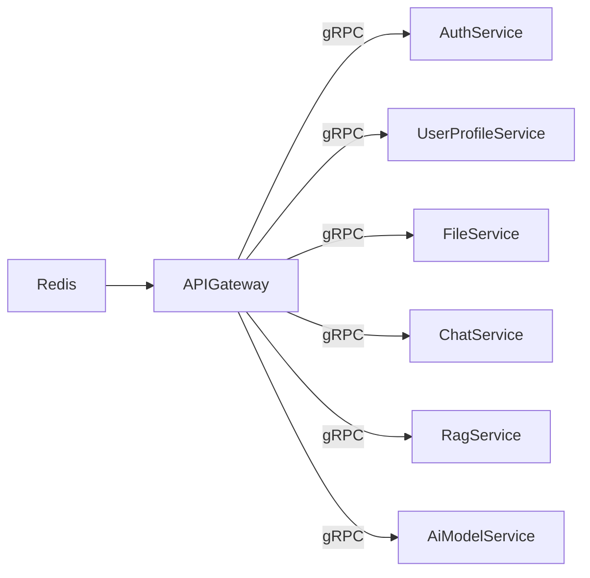

# API Gateway

## Overview
The API Gateway is the single public entrypoint for the platform backend. It accepts client HTTP traffic, enforces edge security and throttling, then proxies requests to internal gRPC services.

## Responsibilities
- Route external APIs under `/api/auth`, `/api/profile`, `/api/files`, `/api/chat`, `/api/rag`, and `/api/ai`.
- Enforce JWT validation and route-level access policy before internal calls.
- Apply Redis-backed rate limits for high-risk and high-throughput routes.
- Propagate service metadata to downstream gRPC services.
- Bridge AI/chat realtime updates to clients through SSE and WebSocket using Redis subscriptions.

## Architecture
- API layer: Spring WebFlux controllers under `controller/` mapped to `/api/internal/**`.
- Edge policy layer: `JwtGlobalFilter`, security configuration, and prompt sanitization filter.
- Integration layer: gRPC blocking stubs for Auth, Profile, File, Chat, RAG, and AI models.
- Realtime layer: `ChatWebSocketHandler` and `ChatRedisSubscriber` for pub/sub and stream fan-out.

## API / gRPC Contracts
### REST Endpoints
- Auth:
  - `POST /api/auth/signup`
  - `POST /api/auth/login`
  - `POST /api/auth/verify-email`
  - `POST /api/auth/resend-verification`
  - `POST /api/auth/refresh`
  - `POST /api/auth/logout`
- Profile:
  - `GET /api/profile/me`
  - `GET /api/profile/{userId}`
  - `PUT /api/profile/me`
  - `GET /api/profile/search`
  - `PATCH /api/profile/visibility`
  - `POST /api/profile/reputation`
- File:
  - `POST /api/files` (multipart upload)
  - `POST /api/files/base64-upload`
  - `POST /api/files/folders`
  - `PUT /api/files/folders/{folderId}`
  - `DELETE /api/files/folders/{folderId}`
  - `POST /api/files/folders/{folderId}/share`
  - `DELETE /api/files/folders/{folderId}/share/{userId}`
  - `GET /api/files/folders`
  - `GET /api/files/folders/shared`
  - `GET /api/files/{fileId}`
  - `DELETE /api/files/{fileId}`
  - `POST /api/files/{fileId}/share`
  - `POST /api/files/{fileId}/unshare`
  - `PATCH /api/files/{fileId}/metadata`
  - `GET /api/files/my`
  - `GET /api/files/shared-with-me`
  - `GET /api/files/{fileId}/path`
  - `GET /api/files/{fileId}/preview`
- Chat:
  - `POST /api/chat/messages`
  - `GET /api/chat/chatrooms`
  - `GET /api/chat/chatrooms/{chatroomId}`
  - `GET /api/chat/chatrooms/{chatroomId}/messages`
  - `POST /api/chat/chatrooms/{chatroomId}/typing`
  - `GET /api/chat/messages/{messageId}/stream`
  - `POST /api/chat/messages/{messageId}/cancel`
- Direct AI execution:
  - `POST /api/ai/executions`
  - `GET /api/ai/executions/{executionId}`
  - `DELETE /api/ai/executions/{executionId}`
  - `GET /api/ai/executions/{executionId}/stream`
- AI model admin:
  - `GET /api/ai/models`
  - `POST /api/ai/models`
  - `POST /api/ai/providers`
  - `POST /api/ai/accounts`
  - `GET /api/ai/providers`
  - `GET /api/ai/accounts`
- RAG:
  - `POST /api/rag/ingest`
  - `POST /api/rag/retrieve`
  - `DELETE /api/rag/vectors/{fileId}`
  - `POST /api/rag/cancel/{requestId}`
  - `GET /api/rag/providers`
  - `GET /api/rag/collection/info`

### gRPC Contracts Consumed
- `proto/auth.proto` (`AuthService`)
- `proto/profile.proto` (`UserProfileService`)
- `proto/file.proto` (`FileService`)
- `proto/chat.proto` (`ChatService`)
- `proto/rag.proto` (`RagService`)
- `proto/ai_models.proto` (`AiModelService`)

## Communication
- Inbound: HTTP/JSON, SSE, and WebSocket from browser/mobile clients.
- Outbound synchronous: gRPC to all internal business services.
- Outbound asynchronous: Redis pub/sub and Redis streams consumption for realtime event fan-out.

## Data Layer
### Database Overview
The gateway is stateless and does not own a relational database. Redis is used for distributed operational state.

### Entities
- `rate_limit_bucket`: route/key token-bucket counters and timestamps.
- `realtime_channel_event`: pub/sub event envelopes for chat, typing, and AI updates.
- `ai_execution_stream_record`: ordered stream entries for direct AI execution updates.

### Relationships
- A `rate_limit_bucket` belongs to one route key and aggregates many request checks.
- A `realtime_channel_event` belongs to one channel and can emit many payloads.
- An `ai_execution_stream_record` belongs to one execution stream key and contains ordered fragments.

### Database Diagram (MANDATORY)

## Key Workflows
1. Client authentication request: route rewrite -> rate-limit filter -> auth gRPC call -> normalized HTTP response.
2. Chat send and stream: message POST -> chat gRPC -> Redis event subscription -> SSE/WebSocket push.
3. Direct AI execution: execution POST -> RAG gRPC `ExecuteDirect` -> status/stream polling endpoints.

## Service Architecture Diagram (MANDATORY)

## Inter-Service Communication Diagram (MANDATORY)

## Environment Variables
| Name | Purpose | Required |
| --- | --- | --- |
| `SERVER_PORT` | HTTP port for gateway | No |
| `SPRING_DATA_REDIS_HOST` | Redis host for rate limiter and realtime subscriptions | Yes |
| `SPRING_DATA_REDIS_PORT` | Redis port | Yes |
| `GRPC_AUTH_ADDRESS` | gRPC target for auth-service | Yes |
| `GRPC_PROFILE_ADDRESS` | gRPC target for user-profile-service | Yes |
| `GRPC_FILE_ADDRESS` | gRPC target for file-service | Yes |
| `GRPC_CHAT_ADDRESS` | gRPC target for chat-service | Yes |
| `GRPC_RAG_ADDRESS` | gRPC target for rag-service | Yes |
| `APP_JWT_ISSUER` | Expected JWT issuer | Yes |
| `APP_JWT_PUBLIC_KEY_LOCATION` | Public key path for JWT signature verification | Yes |
| `APP_GRPC_AUTH_SERVICE_SECRET` | Shared secret metadata for auth-service | Yes |
| `APP_GRPC_PROFILE_SERVICE_SECRET` | Shared secret metadata for user-profile-service | Yes |
| `APP_GRPC_FILE_SERVICE_SECRET` | Shared secret metadata for file-service | Yes |
| `APP_GRPC_CHAT_SERVICE_SECRET` | Shared secret metadata for chat-service | Yes |
| `APP_GRPC_RAG_SERVICE_SECRET` | Shared secret metadata for rag-service | Yes |
| `GATEWAY_ALLOWED_ORIGINS` | CORS allow-list for frontend domains | Yes |

## Running the Service
- Docker (recommended): `docker compose up api-gateway redis auth-service user-profile-service file-service chat-service rag-service`.
- Local Maven: `mvn -f api-gateway/pom.xml spring-boot:run`.

## Scaling & Reliability Considerations
- Rate limiting is distributed through Redis, enabling horizontal gateway scaling.
- Gateway remains stateless; scale replicas independently from downstream service scaling.
- SSE/WebSocket workloads can be isolated by deploying dedicated gateway pods for realtime traffic.
- Backpressure and timeout policies should be tuned per downstream gRPC dependency.