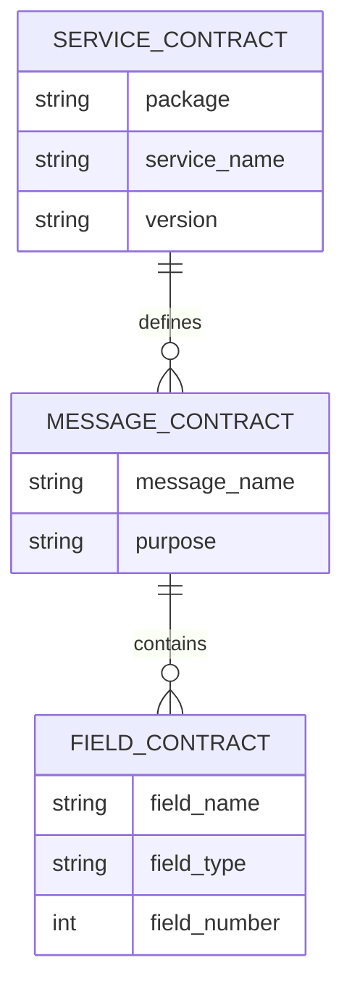
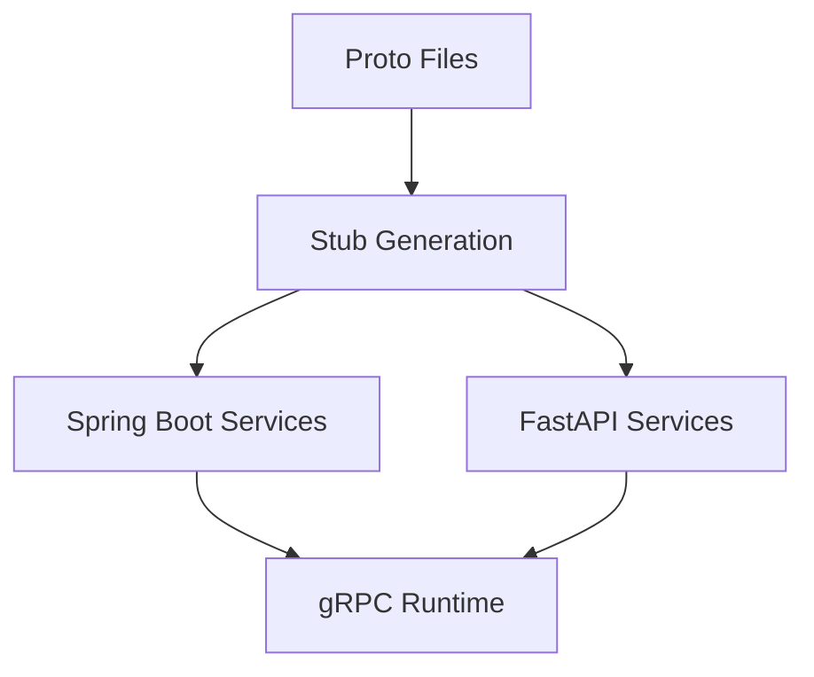
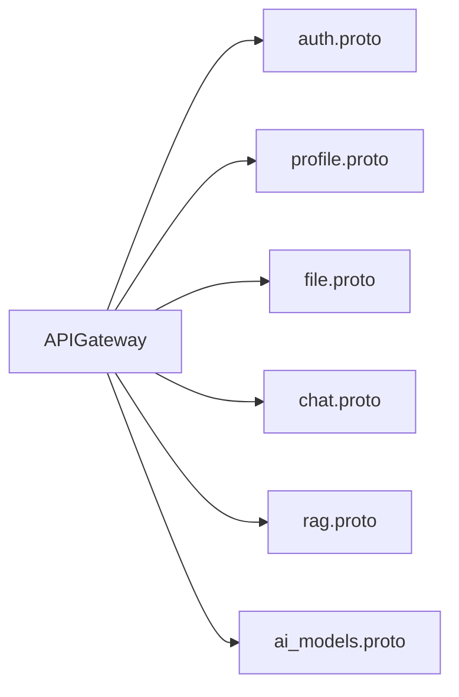

# Proto Contracts

## Overview
The `proto` module is the contract package for the platform's internal gRPC APIs. It defines request/response schemas and service interfaces consumed and implemented across all backend services.

## Responsibilities
- Maintain backward-compatible protobuf contracts for all inter-service gRPC communication.
- Define strongly typed messages and enums for auth, profile, file, chat, RAG, and AI model operations.
- Serve as the canonical source for generated gRPC stubs in Java and Python services.

## Architecture
- Contract source files:
  - `auth.proto`
  - `profile.proto`
  - `file.proto`
  - `chat.proto`
  - `rag.proto`
  - `ai_models.proto`
- Usage model:
  - Service implementations import generated stubs and expose the corresponding RPC server contracts.
  - Gateway and internal clients import generated stubs for downstream calls.

## API / gRPC Contracts
- `auth.v1.AuthService`
- `profile.v1.UserProfileService`
- `file.v1.FileService`
- `chat.v1.ChatService`
- `rag.v1.RagService`
- `ai.v1.AiModelService`

## Communication
- This module does not execute runtime network traffic itself.
- It defines all synchronous communication contracts used by runtime services.

## Data Layer
### Database Overview
No database is owned by this module.

### Entities
- `service_contract`: protobuf service definitions.
- `message_contract`: protobuf message schemas.
- `field_contract`: protobuf field definitions.

### Relationships
- One `service_contract` contains many `message_contract` types.
- One `message_contract` contains many `field_contract` definitions.

### Database Diagram (MANDATORY)

## Key Workflows
1. Author contract change in the relevant `.proto` file.
2. Regenerate stubs in dependent services during build.
3. Validate backward compatibility and integration tests.
4. Roll out providers/consumers in compatible order when adding fields or methods.

## Service Architecture Diagram (MANDATORY)

## Inter-Service Communication Diagram (MANDATORY)

## Environment Variables
| Name | Purpose | Required |
| --- | --- | --- |
| N/A | Contract package does not load runtime environment variables | No |

## Running the Service
This module is not a standalone service. Build or run a consuming service to generate and use stubs.

## Scaling & Reliability Considerations
- Contract evolution should follow additive and backward-compatible protobuf practices.
- Reserve and deprecate field numbers carefully to avoid wire incompatibility.
- Automate contract compatibility checks in CI.
