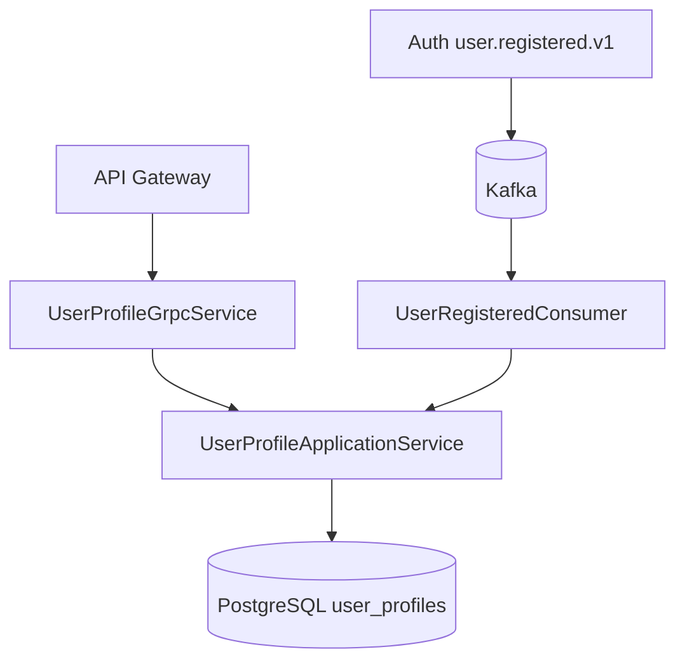

# User Profile Service

## Overview
The User Profile Service manages user profile metadata, profile visibility rules, profile completion scoring, and reputation updates. It is a gRPC-first service and also consumes registration events to bootstrap default profiles.

## Responsibilities
- Serve self-profile and profile-by-id queries.
- Update profile fields and profile image reference.
- Enforce profile visibility rules (`PUBLIC`, `UNIVERSITY_ONLY`, `PRIVATE`).
- Search profiles with visibility filtering.
- Track and increment reputation score.
- Create default profile records when users register.

## Architecture
Spring Boot + JPA + Flyway service with gRPC transport.

- gRPC layer:
  - `UserProfileGrpcService` implements `UserProfileService` from `proto/profile.proto`.
- Application layer:
  - `UserProfileApplicationService` contains visibility, update, search, and scoring logic.
- Persistence layer:
  - `UserProfileRepository` backed by PostgreSQL.
- Event ingestion:
  - `UserRegisteredConsumer` consumes user registration events from Kafka and creates defaults idempotently.

## API / gRPC Contracts
### Exposed gRPC service
From `proto/profile.proto`:
- `GetMyProfile`
- `GetProfileById`
- `UpdateMyProfile`
- `SearchProfiles`
- `UpdateProfileVisibility`
- `IncrementReputation`

### Event contract consumed
- Kafka `user.registered.v1` event from auth-service.

## Data Layer
- Database: PostgreSQL (`user_profile_db`).
- Migration tool: Flyway.
- Core table:
  - `user_profiles` with user identity key, demographic/profile fields, visibility, reputation, and image file id.
- Key semantics:
  - `user_id` is primary key and links profile record to auth identity.
  - `profile_image_file_id` references file-service objects by id (logical cross-service reference).

## Communication
- Sync:
  - gRPC server consumed by `api-gateway` and potentially other internal services.
- Async:
  - Kafka consumer for user registration bootstrap events.

## Key Workflows
1. Default profile bootstrap
   - `UserRegisteredConsumer` receives registration event.
   - `createDefaultProfileIfAbsent` creates initial profile if not present.
2. Profile read with visibility rules
   - Resolve target profile.
   - Evaluate visibility against requesting user context.
   - Return profile or deny with authorization error.
3. Profile update
   - Authenticate requesting user.
   - Update editable fields and optional profile image id.
   - Persist and return updated profile projection.
4. Search
   - Query by optional university/department/name filters.
   - Remove requesting user's own profile.
   - Apply per-record visibility checks before returning results.

## Diagram

